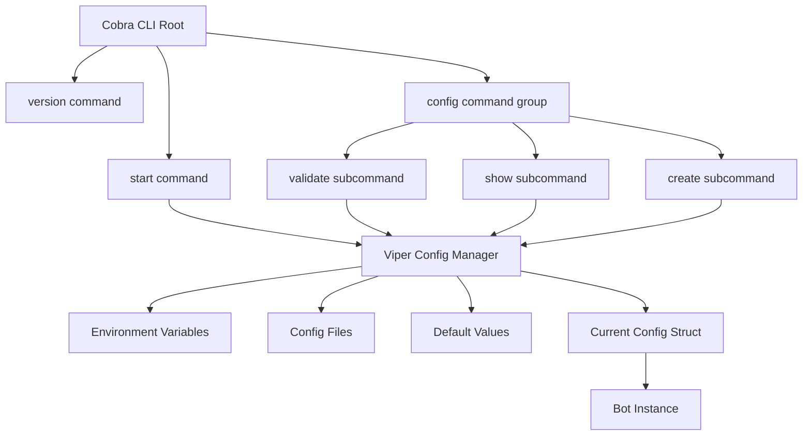
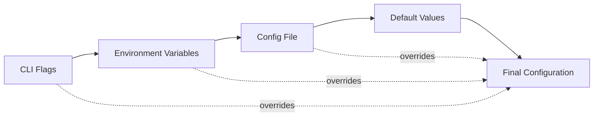

# Design Document

## Overview

This design outlines the migration from basic Go flags and environment variable configuration to a modern CLI architecture using Cobra for command handling and Viper for configuration management.

The design follows the principle of simplicity while adding powerful features that improve operational efficiency and developer experience.

## Architecture

### High-Level Architecture



### Configuration Precedence Flow



## Components and Interfaces

### 1. CLI Command Structure

#### Root Command
- **Purpose**: Main entry point with global flags and help
- **Global Flags**: `--config`, `--log-level`, `--help`, `--version`
- **Subcommands**: `start`, `version`, `config`

#### Start Command
- **Purpose**: Start the Discord TTS bot (current main functionality)
- **Flags**: All current configuration options as CLI flags
- **Behavior**: Load configuration, validate, and start bot

#### Version Command
- **Purpose**: Display version information
- **Output**: Structured version, commit, and build date information
- **Format**: Human-readable with optional JSON output

#### Config Command Group
- **Purpose**: Configuration management utilities
- **Subcommands**: `validate`, `show`, `create`
- **Common Flags**: `--config`, `--format`

### 2. Configuration Management

#### Viper Integration
```go
type ConfigManager struct {
    viper *viper.Viper
    logger *log.Logger
}

type ConfigSource struct {
    Source string // "default", "file", "env", "flag"
    Value  interface{}
}

type ConfigWithSources struct {
    Config  *config.Config
    Sources map[string]ConfigSource
}
```

#### Environment Variable Support
- **Automatic Binding**: Viper's `AutomaticEnv()` with prefix "DRT"
- **Variable Naming**: Environment variables use `DRT_` prefix with uppercase and underscores
- **Examples**: 
  - `DRT_DISCORD_TOKEN` maps to `discord_token`
  - `DRT_TTS_DEFAULT_SPEED` maps to `tts.default_speed`
  - `DRT_LOG_LEVEL` maps to `log_level`

#### Configuration File Locations
1. `./darrot.yaml` (current directory)
2. `~/.darrot.yaml` (user home directory)
3. `/etc/darrot/config.yaml` (system-wide, Linux/macOS)


#### Supported Formats
- YAML (primary)
- JSON (secondary)
- TOML (secondary)

### 3. Enhanced Configuration Structure

#### Extended Config Types
```go
type Config struct {
    // Core configuration
    DiscordToken string `mapstructure:"discord_token"`
    LogLevel     string `mapstructure:"log_level"`
    
    // TTS configuration
    TTS TTSConfig `mapstructure:"tts"`
    
    // New CLI-specific configuration
    CLI CLIConfig `mapstructure:"cli"`
}

type CLIConfig struct {
    ConfigFile     string `mapstructure:"config_file"`
    EnableColors   bool   `mapstructure:"enable_colors"`
    CompletionShell string `mapstructure:"completion_shell"`
}
```

## Data Models

### Command Structure
```go
// cmd/darrot/main.go - Root command setup
var rootCmd = &cobra.Command{
    Use:   "darrot",
    Short: "Discord TTS Bot",
    Long:  "A Discord bot that converts text messages to speech",
}

// cmd/darrot/start.go - Start command
var startCmd = &cobra.Command{
    Use:   "start",
    Short: "Start the Discord TTS bot",
    RunE:  runStart,
}

// cmd/darrot/config.go - Config command group
var configCmd = &cobra.Command{
    Use:   "config",
    Short: "Configuration management",
}
```

### Configuration Mapping
```yaml
# Example darrot.yaml
discord_token: "your-bot-token"
log_level: "INFO"

tts:
  google_cloud_credentials_path: "/path/to/credentials.json"
  default_voice: "en-US-Standard-A"
  default_speed: 1.0
  default_volume: 1.0
  max_queue_size: 10
  max_message_length: 500

cli:
  enable_colors: true
  completion_shell: "bash"
```

## Error Handling

### Configuration Validation
- **File Not Found**: Graceful fallback to environment variables and defaults
- **Invalid Format**: Clear error messages with line numbers and suggestions
- **Missing Required Values**: Specific error messages indicating which values are missing
- **Invalid Values**: Range and format validation with acceptable value suggestions

### CLI Error Handling
- **Unknown Commands**: Suggest similar commands using Levenshtein distance
- **Invalid Flags**: Show available flags and usage examples
- **Configuration Conflicts**: Clear precedence explanation and resolution steps

### Error Message Examples
```
Error: Invalid configuration value
  → tts.default_speed: 5.0 is not valid
  → Must be between 0.25 and 4.0
  → Current value from: config file (/home/user/.darrot.yaml:8)

Suggestion: Update the value in your config file or override with:
  darrot start --tts-default-speed 1.0
```

## Testing Strategy

### Unit Testing
- **Command Parsing**: Test all CLI commands and flag combinations
- **Configuration Loading**: Test all configuration sources and precedence
- **Validation Logic**: Test all validation rules and error conditions
- **File Operations**: Test config file creation, reading, and writing

### Integration Testing
- **End-to-End CLI**: Test complete command workflows
- **Configuration Integration**: Test real configuration file loading
- **Backward Compatibility**: Test existing environment variable configurations
- **Linux-focused**: Test on Linux with container deployment

### Test Structure
```go
// Test configuration precedence
func TestConfigPrecedence(t *testing.T) {
    // Test CLI flag overrides environment variable
    // Test environment variable overrides config file
    // Test config file overrides defaults
}

// Test command execution
func TestStartCommand(t *testing.T) {
    // Test successful start with various config sources
    // Test start with invalid configuration
    // Test start with missing required values
}
```

### Mock Strategy
- **File System Operations**: Mock config file reading/writing
- **Environment Variables**: Mock environment variable access
- **Bot Initialization**: Mock bot startup for CLI testing
- **External Dependencies**: Mock Viper and Cobra where necessary

## Implementation Phases

### Phase 1: Core CLI Structure
1. Add Cobra and Viper dependencies
2. Create command structure (root, start, version, config)
3. Implement basic Viper configuration loading from files and CLI flags
4. Replace existing main.go with Cobra command execution

### Phase 2: Configuration Management
1. Implement config subcommands (validate, show, create)
2. Add comprehensive error handling and validation
3. Support multiple configuration file formats
4. Add shell completion support

### Phase 3: Polish and Testing
1. Enhanced error messages and help text
2. Comprehensive testing suite
3. Documentation updates
4. Final integration and cleanup

## Migration Strategy

### Modern CLI Implementation
- **Cobra/Viper Architecture**: Clean implementation using modern Go CLI patterns
- **Multiple Configuration Sources**: Support for config files, environment variables, and CLI flags
- **Simplified Environment Variables**: Use Viper's automatic environment variable binding with "DRT" prefix
- **Configuration Files**: Primary focus on YAML/JSON/TOML configuration files with automatic discovery

### Environment Variable Changes
- **New Prefix**: All environment variables must use "DRT_" prefix (e.g., `DRT_DISCORD_TOKEN`)
- **Automatic Mapping**: Viper automatically maps environment variables to configuration keys
- **Backward Compatibility**: Existing environment variables without prefix will no longer work
- **Migration Required**: Users must update environment variable names to include "DRT_" prefix