# Design Document

## Overview

The container testing framework provides comprehensive validation of the darrot Discord TTS bot through two complementary testing approaches: container structure tests that validate Docker image integrity and acceptance tests that simulate real Discord interactions using a mock Discord API server. This framework ensures both the containerized deployment and functional behavior work correctly before production deployment.

## Architecture

### High-Level Architecture

```mermaid
graph TB
    subgraph "CI/CD Pipeline"
        A[Code Changes] --> B[Container Structure Tests]
        B --> C[Build Container Image]
        C --> D[Acceptance Tests]
        D --> E[Deploy to Production]
    end
    
    subgraph "Container Structure Tests"
        F[Image Validation] --> G[Security Checks]
        G --> H[Dependency Verification]
        H --> I[Permission Tests]
    end
    
    subgraph "Acceptance Tests"
        J[Mock Discord API] --> K[Bot Instance]
        K --> L[Command Simulation]
        L --> M[Audio Validation]
        M --> N[Error Scenario Tests]
    end
    
    subgraph "Test Infrastructure"
        O[Container Test Tool] --> P[Mock API Server]
        P --> Q[Audio Processing Mock]
        Q --> R[Test Orchestrator]
    end
```



### Component Architecture

The framework consists of four main components:

1. **Container Structure Validator** - Validates Docker image properties and security
2. **Mock Discord API Server** - Simulates Discord Gateway and REST API endpoints
3. **Acceptance Test Suite** - Orchestrates bot testing scenarios
4. **Audio Processing Validator** - Validates TTS audio generation and streaming

## Components and Interfaces

### Container Structure Validator

**Purpose**: Validates Docker image integrity, security, and compliance with deployment requirements.

**Implementation**: Google Container Structure Test tool with custom YAML configuration for darrot-specific validations.

**Tool**: `container-structure-test` - Google's proven container testing framework
- Installation: `curl -LO https://storage.googleapis.com/container-structure-test/latest/container-structure-test-linux-amd64`
- Configuration: YAML-based test definitions
- Integration: CI/CD pipeline compatible with JSON output

**Configuration Structure**:
```yaml
# tests/container/structure-test.yaml
schemaVersion: 2.0.0
commandTests:
  - name: "darrot binary exists and is executable"
    command: "/app/darrot"
    args: ["--version"]
    expectedOutput: ["darrot version"]
    
  - name: "opus libraries are available"
    command: "pkg-config"
    args: ["--exists", "opus"]
    exitCode: 0

fileExistenceTests:
  - name: "application binary"
    path: "/app/darrot"
    shouldExist: true
    permissions: "-rwxr-xr-x"
    
  - name: "data directory"
    path: "/app/data"
    shouldExist: true
    isDirectory: true

metadataTest:
  user: "darrot"
  exposedPorts: []
  workdir: "/app"
  
licenseTests:
  - debian: false
    files: []
```

**Key Features**:
- Binary presence and execution validation using command tests
- Opus library dependency verification via pkg-config
- Non-root user security validation through metadata tests
- File permission and directory structure validation
- Integration with existing CI/CD tools and JSON reporting

### Mock Discord API Server

**Purpose**: Provides a realistic Discord API simulation for testing bot interactions without requiring real Discord servers.

**Implementation Options**:

1. **Recommended: Custom Go Mock Server** - Purpose-built for darrot testing needs
   - Lightweight implementation focusing on TTS bot requirements
   - WebSocket Gateway simulation for real-time events
   - REST API endpoints for essential bot operations
   - Built-in audio stream capture for TTS validation

2. **Alternative: discord-mock (Node.js)** - Existing open-source solution
   - Containerized Node.js application
   - Requires adaptation for voice channel simulation
   - More comprehensive but potentially over-engineered for our needs

3. **Alternative: Fosscord Server** - Full Discord-compatible implementation
   - Complete Discord server replacement
   - Heavyweight solution, complex setup
   - Overkill for testing purposes but most realistic

**Recommended Approach**: Custom Go implementation for optimal integration with darrot's Go ecosystem and specific TTS testing requirements.

```go
type MockDiscordServer interface {
    Start(port int) error
    Stop() error
    SimulateUser(userID string) *MockUser
    CreateGuild(guildID string) *MockGuild
    GetInteractions() []Interaction
    Reset() error
}

type MockUser interface {
    SendMessage(channelID, content string) error
    JoinVoiceChannel(channelID string) error
    LeaveVoiceChannel() error
    SendSlashCommand(command string, options map[string]interface{}) error
}

type MockGuild interface {
    CreateTextChannel(name string) *MockChannel
    CreateVoiceChannel(name string) *MockChannel
    AddUser(user *MockUser) error
    SetPermissions(userID string, permissions int64) error
}
```

**Key Features**:
- WebSocket Gateway simulation for real-time events
- REST API endpoints for bot commands and responses
- Voice channel simulation with audio stream capture
- Rate limiting simulation for testing bot resilience
- Permission system simulation for testing access controls

### Acceptance Test Suite

**Purpose**: Orchestrates comprehensive testing scenarios that validate bot functionality end-to-end.

**Implementation**: Go test suite using testify framework with scenario-based test organization.

```go
type AcceptanceTestSuite struct {
    mockServer    MockDiscordServer
    botInstance   *BotInstance
    audioCapture  *AudioCapture
    testTimeout   time.Duration
}

type TestScenario interface {
    Setup() error
    Execute() error
    Validate() error
    Cleanup() error
}

type BotInstance interface {
    Start(config *Config) error
    Stop() error
    IsHealthy() bool
    GetLogs() []LogEntry
}
```

**Test Scenarios**:
- Basic command execution (darrot-join, darrot-leave)
- TTS message processing and audio generation
- Multi-user concurrent message handling
- Error recovery and reconnection testing
- Configuration command validation
- Permission-based access control testing

### Audio Processing Validator

**Purpose**: Validates TTS audio generation, format compliance, and Discord voice integration.

**Implementation**: Audio analysis tools using Opus codec validation and stream capture.

```go
type AudioValidator interface {
    CaptureAudioStream(channelID string) (*AudioCapture, error)
    ValidateOpusFormat(audioData []byte) (*FormatValidation, error)
    AnalyzeAudioQuality(audioData []byte) (*QualityReport, error)
    VerifyTTSContent(audioData []byte, expectedText string) (*ContentValidation, error)
}

type AudioCapture struct {
    ChannelID     string
    Duration      time.Duration
    Format        string
    SampleRate    int
    Bitrate       int
    AudioData     []byte
    Timestamp     time.Time
}
```

**Key Features**:
- Opus/DCA format validation for Discord compatibility
- Audio quality analysis (bitrate, sample rate, clarity)
- TTS content verification against input text
- Audio stream timing and synchronization validation
- Voice channel connection lifecycle testing

## Data Models

### Test Configuration

```go
type TestConfig struct {
    Container struct {
        ImageName     string        `yaml:"image_name"`
        TestTimeout   time.Duration `yaml:"test_timeout"`
        ResourceLimits struct {
            Memory string `yaml:"memory"`
            CPU    string `yaml:"cpu"`
        } `yaml:"resource_limits"`
    } `yaml:"container"`
    
    MockAPI struct {
        Port            int           `yaml:"port"`
        GatewayPort     int           `yaml:"gateway_port"`
        ResponseDelay   time.Duration `yaml:"response_delay"`
        RateLimitConfig struct {
            RequestsPerMinute int `yaml:"requests_per_minute"`
            BurstLimit        int `yaml:"burst_limit"`
        } `yaml:"rate_limit"`
    } `yaml:"mock_api"`
    
    Bot struct {
        StartupTimeout time.Duration `yaml:"startup_timeout"`
        ConfigPath     string        `yaml:"config_path"`
        LogLevel       string        `yaml:"log_level"`
    } `yaml:"bot"`
    
    Audio struct {
        CaptureTimeout time.Duration `yaml:"capture_timeout"`
        ExpectedFormat string        `yaml:"expected_format"`
        QualityThresholds struct {
            MinBitrate   int `yaml:"min_bitrate"`
            MaxLatency   time.Duration `yaml:"max_latency"`
        } `yaml:"quality_thresholds"`
    } `yaml:"audio"`
}
```

### Test Results

```go
type TestResults struct {
    TestSuite     string                 `json:"test_suite"`
    StartTime     time.Time             `json:"start_time"`
    EndTime       time.Time             `json:"end_time"`
    Duration      time.Duration         `json:"duration"`
    TotalTests    int                   `json:"total_tests"`
    PassedTests   int                   `json:"passed_tests"`
    FailedTests   int                   `json:"failed_tests"`
    SkippedTests  int                   `json:"skipped_tests"`
    TestCases     []TestCaseResult      `json:"test_cases"`
    Artifacts     []TestArtifact        `json:"artifacts"`
}

type TestCaseResult struct {
    Name        string        `json:"name"`
    Status      TestStatus    `json:"status"`
    Duration    time.Duration `json:"duration"`
    ErrorMsg    string        `json:"error_message,omitempty"`
    Logs        []string      `json:"logs,omitempty"`
    Metrics     TestMetrics   `json:"metrics,omitempty"`
}
```

## Error Handling

### Container Validation Errors

**Strategy**: Fail-fast approach with detailed error reporting and remediation suggestions.

```go
type ValidationError struct {
    Component   string
    Issue       string
    Severity    ErrorSeverity
    Suggestion  string
    Details     map[string]interface{}
}

type ErrorSeverity int

const (
    SeverityWarning ErrorSeverity = iota
    SeverityError
    SeverityCritical
)
```

**Error Categories**:
- **Critical**: Security vulnerabilities, missing dependencies, invalid container structure
- **Error**: Configuration issues, permission problems, resource constraint violations
- **Warning**: Performance concerns, non-optimal configurations, deprecated features

### Mock API Error Simulation

**Strategy**: Simulate realistic Discord API errors to test bot resilience and error handling.

**Simulated Errors**:
- Network timeouts and connection failures
- Rate limiting responses (429 status codes)
- Authentication failures (401 status codes)
- Permission denied errors (403 status codes)
- Invalid request format errors (400 status codes)
- Server errors (500 status codes)

### Test Execution Error Recovery

**Strategy**: Robust test execution with automatic cleanup and retry mechanisms.

```go
type TestExecutor struct {
    maxRetries    int
    retryDelay    time.Duration
    cleanupFuncs  []func() error
    errorHandler  ErrorHandler
}

func (te *TestExecutor) ExecuteWithRetry(test TestScenario) error {
    for attempt := 0; attempt <= te.maxRetries; attempt++ {
        if err := test.Execute(); err != nil {
            if attempt == te.maxRetries {
                return fmt.Errorf("test failed after %d attempts: %w", te.maxRetries+1, err)
            }
            te.errorHandler.HandleRetry(err, attempt)
            time.Sleep(te.retryDelay)
            continue
        }
        return nil
    }
    return nil
}
```

## Testing Strategy

### Container Structure Testing

**Tool**: Google Container Structure Test - industry-standard container validation tool

**Test Categories**:
1. **Image Integrity**: Binary presence, file permissions, directory structure
2. **Security Compliance**: Non-root user, minimal attack surface, secure defaults
3. **Dependency Validation**: Opus libraries, system packages, Go runtime
4. **Resource Efficiency**: Image size, layer optimization, startup time
5. **Configuration Handling**: Environment variables, volume mounts, health checks

**Implementation Approach**:
```bash
# Container structure test execution
container-structure-test test --image darrot:test --config tests/container/structure-test.yaml --output json
```

**Advantages of Google Container Tools**:
- Industry-proven tool used by Google and major organizations
- Comprehensive test types: command, file existence, metadata, license
- JSON output for CI/CD integration
- No custom tooling maintenance required
- Extensive documentation and community support

### Acceptance Testing

**Framework**: Go test suite with Docker Compose orchestration

**Test Environment Setup**:
```yaml
# docker-compose.test.yml
version: '3.8'
services:
  mock-discord:
    build: 
      context: ./tests/mock-discord
      dockerfile: Dockerfile
    ports:
      - "8080:8080"  # REST API
      - "8081:8081"  # WebSocket Gateway
    environment:
      - MOCK_GUILD_ID=test-guild-123
      - MOCK_USER_ID=test-user-456
      - LOG_LEVEL=DEBUG
    healthcheck:
      test: ["CMD", "curl", "-f", "http://localhost:8080/health"]
      interval: 10s
      timeout: 5s
      retries: 3
  
  darrot-test:
    build: .
    depends_on:
      mock-discord:
        condition: service_healthy
    environment:
      - DISCORD_API_URL=http://mock-discord:8080
      - DISCORD_GATEWAY_URL=ws://mock-discord:8081
      - DISCORD_TOKEN=test-token-123
      - LOG_LEVEL=DEBUG
    volumes:
      - ./tests/data:/app/data
      - ./tests/audio-output:/app/audio-output
```

**Alternative: Using Existing discord-mock Container**:
```yaml
# Using existing Node.js discord-mock (if available)
services:
  mock-discord:
    image: discord-mock:latest  # Hypothetical existing image
    ports:
      - "3000:3000"
    environment:
      - NODE_ENV=test
      - DISCORD_CLIENT_ID=test-client-123
```

**Test Execution Flow**:
1. Start mock Discord API server
2. Launch bot instance with test configuration
3. Execute test scenarios in parallel
4. Capture audio streams and validate output
5. Generate test reports and artifacts
6. Cleanup test environment

### Performance and Load Testing

**Scenarios**:
- Concurrent message processing (10+ users simultaneously)
- High-frequency command execution (rate limit testing)
- Long-running voice channel sessions (memory leak detection)
- Large message queue processing (queue overflow testing)

**Metrics Collection**:
- Response time percentiles (P50, P95, P99)
- Memory usage patterns and peak consumption
- CPU utilization during audio processing
- Network bandwidth usage for voice streaming
- Error rates under load conditions

## Integration Points

### CI/CD Pipeline Integration

**GitHub Actions Workflow**:
```yaml
name: Container Testing
on: [push, pull_request]

jobs:
  container-tests:
    runs-on: ubuntu-latest
    steps:
      - uses: actions/checkout@v4
      
      - name: Build Container
        run: docker build -t darrot:test .
      
      - name: Install Container Structure Test
        run: |
          curl -LO https://storage.googleapis.com/container-structure-test/latest/container-structure-test-linux-amd64
          chmod +x container-structure-test-linux-amd64
          sudo mv container-structure-test-linux-amd64 /usr/local/bin/container-structure-test
      
      - name: Run Structure Tests
        run: container-structure-test test --image darrot:test --config tests/container/structure-test.yaml --output json
      
      - name: Run Acceptance Tests
        run: |
          docker-compose -f docker-compose.test.yml up -d
          go test ./tests/acceptance/... -v
          docker-compose -f docker-compose.test.yml down
      
      - name: Upload Test Artifacts
        uses: actions/upload-artifact@v4
        with:
          name: test-results
          path: |
            tests/results/
            tests/audio-samples/
```

### Development Workflow Integration

**Local Development**:
```bash
# Quick container validation
make test-container

# Full acceptance test suite
make test-acceptance

# Specific test scenario
make test-scenario SCENARIO=voice-channel-join
```

**IDE Integration**: VS Code tasks and launch configurations for running specific test scenarios during development.

### Monitoring and Observability

**Test Metrics Dashboard**: Integration with existing monitoring to track test execution trends, failure rates, and performance regressions.

**Alerting**: Automated notifications for test failures in CI/CD pipelines with detailed failure analysis and remediation suggestions.