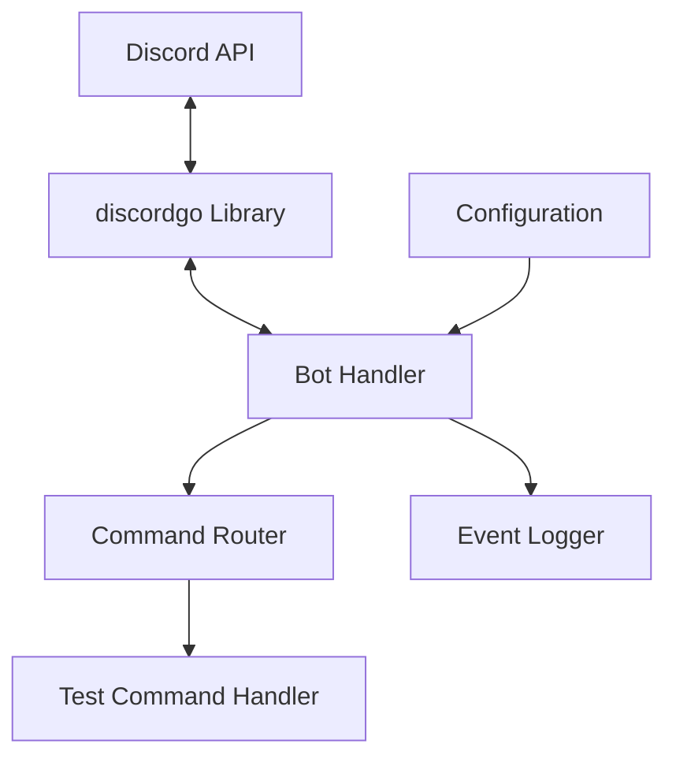
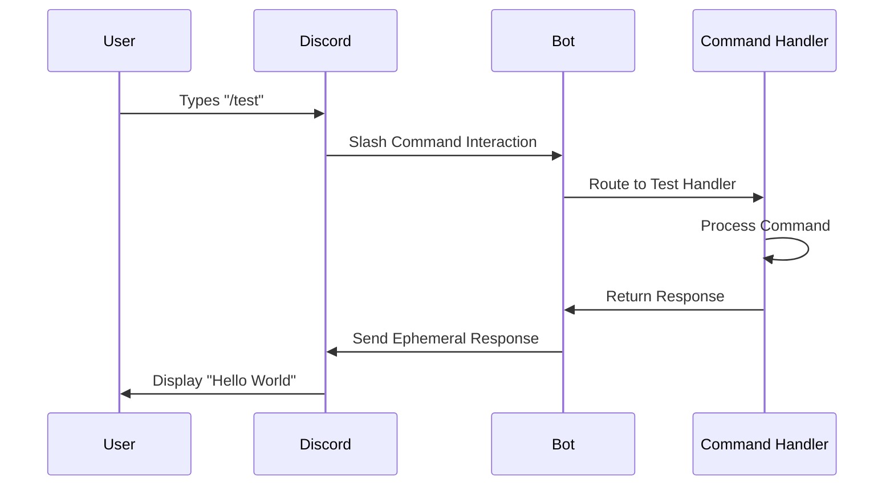

# Design Document

## Overview

This design implements a Discord slash command system for the darrot TTS bot, starting with a basic "/test" command that responds with "Hello World". The implementation uses the discordgo library to handle Discord API interactions and establishes the foundation for future TTS commands.

The design follows Go best practices with clear separation of concerns, proper error handling, and a modular architecture that can be extended for additional commands.

## Architecture

### High-Level Architecture



### Component Interaction Flow



## Components and Interfaces

### 1. Bot Core (`internal/bot/bot.go`)

**Responsibilities:**
- Initialize Discord session
- Register slash commands
- Handle Discord events
- Route commands to appropriate handlers

**Key Methods:**
```go
type Bot struct {
    session *discordgo.Session
    config  *config.Config
    logger  *log.Logger
}

func New(config *config.Config) (*Bot, error)
func (b *Bot) Start() error
func (b *Bot) Stop() error
func (b *Bot) registerCommands() error
```

### 2. Command Handler Interface (`internal/bot/commands.go`)

**Responsibilities:**
- Define command handler interface
- Implement command routing logic
- Handle command registration

**Key Interfaces:**
```go
type CommandHandler interface {
    Handle(s *discordgo.Session, i *discordgo.InteractionCreate) error
    Definition() *discordgo.ApplicationCommand
}

type CommandRouter struct {
    handlers map[string]CommandHandler
}
```

### 3. Test Command Handler (`internal/bot/test_command.go`)

**Responsibilities:**
- Implement the "/test" command logic
- Return "Hello World" response
- Handle command-specific errors

**Implementation:**
```go
type TestCommandHandler struct {
    logger *log.Logger
}

func (h *TestCommandHandler) Handle(s *discordgo.Session, i *discordgo.InteractionCreate) error
func (h *TestCommandHandler) Definition() *discordgo.ApplicationCommand
```

### 4. Configuration (`internal/config/config.go`)

**Responsibilities:**
- Load Discord bot token
- Manage application settings
- Validate configuration

**Structure:**
```go
type Config struct {
    DiscordToken string
    LogLevel     string
}
```

## Data Models

### Discord Command Definition

```go
var TestCommand = &discordgo.ApplicationCommand{
    Name:        "test",
    Description: "Test command that responds with Hello World",
    Type:        discordgo.ChatApplicationCommand,
}
```

### Command Response

```go
type CommandResponse struct {
    Content   string
    Ephemeral bool
    Embeds    []*discordgo.MessageEmbed
}
```

## Error Handling

### Error Categories

1. **Configuration Errors**
   - Missing Discord token
   - Invalid configuration values
   - Log with FATAL level and exit

2. **Discord API Errors**
   - Connection failures
   - Authentication errors
   - Rate limiting
   - Log with ERROR level and retry where appropriate

3. **Command Execution Errors**
   - Permission errors
   - Interaction timeout
   - Log with WARN level and send user-friendly error response

### Error Response Strategy

```go
func handleCommandError(s *discordgo.Session, i *discordgo.InteractionCreate, err error) {
    response := &discordgo.InteractionResponse{
        Type: discordgo.InteractionResponseChannelMessageWithSource,
        Data: &discordgo.InteractionResponseData{
            Content:   "Sorry, something went wrong processing your command.",
            Flags:     discordgo.MessageFlagsEphemeral,
        },
    }
    s.InteractionRespond(i.Interaction, response)
}
```

## Testing Strategy

### Unit Tests

1. **Command Handler Tests** (`internal/bot/test_command_test.go`)
   - Test successful command execution
   - Test error scenarios
   - Mock Discord session interactions

2. **Configuration Tests** (`internal/config/config_test.go`)
   - Test configuration loading
   - Test validation logic
   - Test environment variable handling

3. **Bot Integration Tests** (`internal/bot/bot_test.go`)
   - Test command registration
   - Test event handling
   - Mock Discord API responses

### Test Structure Example

```go
func TestTestCommandHandler_Handle(t *testing.T) {
    tests := []struct {
        name    string
        setup   func() (*discordgo.Session, *discordgo.InteractionCreate)
        wantErr bool
    }{
        {
            name: "successful_hello_world_response",
            setup: func() (*discordgo.Session, *discordgo.InteractionCreate) {
                // Mock setup
            },
            wantErr: false,
        },
    }
}
```

### Integration Testing

- Test with Discord's test server
- Verify command registration
- Validate response format and timing
- Test error scenarios (network issues, permission problems)

## Implementation Notes

### Dependencies

- `github.com/bwmarrin/discordgo` - Discord API library
- `github.com/joho/godotenv` - Environment variable loading
- Standard library `log` package for logging

### Security Considerations

- Discord bot token stored in environment variables
- No sensitive data in command responses
- Proper input validation for future commands
- Rate limiting awareness

### Performance Considerations

- Ephemeral responses to reduce server message load
- Efficient command routing with map lookup
- Minimal memory allocation in command handlers
- Connection pooling handled by discordgo library