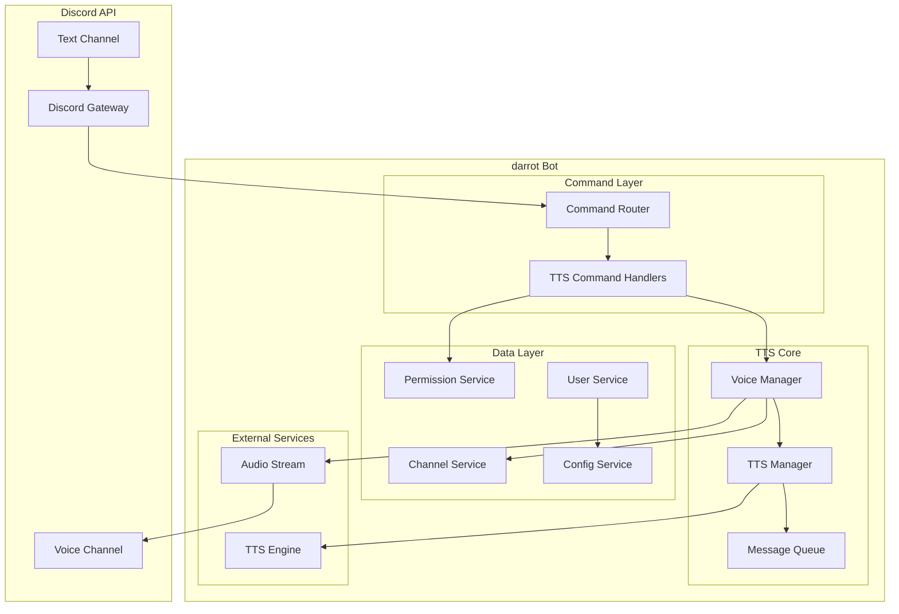

# Design Document

## Overview

The Discord TTS Voice feature extends the existing darrot bot to provide text-to-speech functionality in Discord voice channels. The system creates voice-text channel pairings where the bot joins a voice channel and reads messages from a specified text channel aloud to users in the voice channel. The design emphasizes user privacy through opt-in mechanisms, role-based access control, and robust error handling.

## Architecture

### High-Level Architecture



### Component Interaction Flow

1. **Command Processing**: User invokes TTS command → Command Router → TTS Handler
2. **Permission Validation**: TTS Handler → Permission Service → Role/Channel validation
3. **Channel Management**: TTS Handler → Channel Service → Voice/Text channel pairing
4. **Voice Connection**: Voice Manager → Discord Voice API → Join voice channel
5. **Message Monitoring**: Text channel events → Message Queue → TTS processing
6. **Speech Generation**: TTS Manager → External TTS Engine → Audio stream
7. **Audio Output**: Audio stream → Discord Voice Connection → Voice channel

## Components and Interfaces

### 1. TTS Command Handlers

**Purpose**: Handle Discord slash commands for TTS functionality

**Key Components**:
- `JoinCommandHandler`: Processes voice channel join requests
- `LeaveCommandHandler`: Handles voice channel leave requests
- `ControlCommandHandler`: Manages pause/resume/skip commands
- `OptInCommandHandler`: Manages user opt-in/opt-out preferences
- `ConfigCommandHandler`: Handles administrator configuration

**Interface**:
```go
type TTSCommandHandler interface {
    CommandHandler // Extends existing CommandHandler interface
    ValidatePermissions(userID, guildID string) error
    ValidateChannelAccess(userID, channelID string) error
}
```

### 2. Voice Manager

**Purpose**: Manages Discord voice connections and audio streaming

**Key Responsibilities**:
- Establish and maintain voice channel connections
- Coordinate with TTS Manager for audio playback
- Handle voice connection errors and reconnection
- Manage multiple voice connections per guild

**Interface**:
```go
type VoiceManager interface {
    JoinChannel(guildID, channelID string) (*VoiceConnection, error)
    LeaveChannel(guildID string) error
    GetConnection(guildID string) (*VoiceConnection, bool)
    PlayAudio(guildID string, audioData []byte) error
    IsConnected(guildID string) bool
}

type VoiceConnection struct {
    GuildID     string
    ChannelID   string
    Connection  *discordgo.VoiceConnection
    IsPlaying   bool
    Queue       *AudioQueue
}
```

### 3. TTS Manager

**Purpose**: Convert text messages to speech and manage audio processing

**Key Responsibilities**:
- Interface with external TTS engines
- Process message queue for speech conversion
- Handle audio format conversion and streaming
- Manage TTS configuration (voice, speed, volume)

**Interface**:
```go
type TTSManager interface {
    ConvertToSpeech(text, voice string, config TTSConfig) ([]byte, error)
    ProcessMessageQueue(guildID string) error
    SetVoiceConfig(guildID string, config TTSConfig) error
    GetSupportedVoices() []Voice
}

type TTSConfig struct {
    Voice  string
    Speed  float32
    Volume float32
    Format AudioFormat
}
```

### 4. Channel Service

**Purpose**: Manage voice-text channel pairings and monitoring

**Key Responsibilities**:
- Create and maintain channel pairings
- Monitor text channels for new messages
- Validate channel accessibility
- Handle channel pairing conflicts

**Interface**:
```go
type ChannelService interface {
    CreatePairing(guildID, voiceChannelID, textChannelID string) error
    RemovePairing(guildID, voiceChannelID string) error
    GetPairing(guildID, voiceChannelID string) (*ChannelPairing, error)
    ValidateChannelAccess(userID, channelID string) error
    IsChannelPaired(guildID, textChannelID string) bool
}

type ChannelPairing struct {
    GuildID        string
    VoiceChannelID string
    TextChannelID  string
    CreatedBy      string
    CreatedAt      time.Time
}
```

### 5. Permission Service

**Purpose**: Handle role-based access control and user permissions

**Key Responsibilities**:
- Validate user roles for bot invitations
- Check channel access permissions
- Manage administrator configurations
- Handle permission caching

**Interface**:
```go
type PermissionService interface {
    CanInviteBot(userID, guildID string) (bool, error)
    CanControlBot(userID, guildID string) (bool, error)
    HasChannelAccess(userID, channelID string) (bool, error)
    SetRequiredRoles(guildID string, roleIDs []string) error
    GetRequiredRoles(guildID string) ([]string, error)
}
```

### 6. User Service

**Purpose**: Manage user opt-in preferences and settings

**Key Responsibilities**:
- Track user opt-in status per guild
- Handle opt-in/opt-out requests
- Validate message author permissions
- Manage user-specific TTS preferences

**Interface**:
```go
type UserService interface {
    SetOptInStatus(userID, guildID string, optedIn bool) error
    IsOptedIn(userID, guildID string) (bool, error)
    GetOptedInUsers(guildID string) ([]string, error)
    AutoOptIn(userID, guildID string) error // For bot inviters
}
```

### 7. Message Queue

**Purpose**: Queue and process text messages for TTS conversion

**Key Responsibilities**:
- Queue incoming messages from monitored channels
- Prioritize and filter messages based on opt-in status
- Handle message truncation and rate limiting
- Manage queue overflow scenarios

**Interface**:
```go
type MessageQueue interface {
    Enqueue(message *QueuedMessage) error
    Dequeue(guildID string) (*QueuedMessage, error)
    Clear(guildID string) error
    Size(guildID string) int
    SetMaxSize(guildID string, size int) error
}

type QueuedMessage struct {
    ID        string
    GuildID   string
    ChannelID string
    UserID    string
    Username  string
    Content   string
    Timestamp time.Time
}
```

## Data Models

### Configuration Storage

**Guild TTS Configuration**:
```go
type GuildTTSConfig struct {
    GuildID       string    `json:"guild_id"`
    RequiredRoles []string  `json:"required_roles"`
    TTSSettings   TTSConfig `json:"tts_settings"`
    MaxQueueSize  int       `json:"max_queue_size"`
    UpdatedAt     time.Time `json:"updated_at"`
}
```

**User Preferences**:
```go
type UserTTSPreferences struct {
    UserID    string             `json:"user_id"`
    GuildID   string             `json:"guild_id"`
    OptedIn   bool               `json:"opted_in"`
    Settings  UserTTSSettings    `json:"settings"`
    UpdatedAt time.Time          `json:"updated_at"`
}

type UserTTSSettings struct {
    PreferredVoice string  `json:"preferred_voice"`
    SpeedModifier  float32 `json:"speed_modifier"`
}
```

**Channel Pairings**:
```go
type ChannelPairingStorage struct {
    GuildID        string    `json:"guild_id"`
    VoiceChannelID string    `json:"voice_channel_id"`
    TextChannelID  string    `json:"text_channel_id"`
    CreatedBy      string    `json:"created_by"`
    CreatedAt      time.Time `json:"created_at"`
    IsActive       bool      `json:"is_active"`
}
```

### In-Memory State

**Active Voice Sessions**:
```go
type VoiceSession struct {
    GuildID        string
    VoiceChannelID string
    TextChannelID  string
    Connection     *discordgo.VoiceConnection
    MessageQueue   *MessageQueue
    IsPlaying      bool
    IsPaused       bool
    CreatedBy      string
    CreatedAt      time.Time
}
```

## Error Handling

### Error Categories

1. **Permission Errors**: User lacks required roles or channel access
2. **Connection Errors**: Discord API connectivity issues
3. **TTS Errors**: Text-to-speech conversion failures
4. **Configuration Errors**: Invalid settings or missing configuration
5. **Resource Errors**: Queue overflow, memory limits, rate limiting

### Error Handling Strategy

**Graceful Degradation**:
- Continue operation when non-critical components fail
- Provide fallback behavior for TTS engine failures
- Maintain voice connection even if message processing fails

**User Communication**:
- Send clear, actionable error messages to users
- Use ephemeral responses for error notifications
- Provide troubleshooting guidance for common issues

**Logging and Monitoring**:
- Log all errors with appropriate context
- Track error patterns for system health monitoring
- Implement retry mechanisms for transient failures

**Recovery Mechanisms**:
```go
type ErrorRecovery interface {
    HandleVoiceDisconnection(guildID string) error
    HandleTTSFailure(message *QueuedMessage) error
    HandlePermissionError(userID, guildID string) error
    HandleRateLimit(retryAfter time.Duration) error
}
```

## Testing Strategy

### Unit Testing

**Component Testing**:
- Test each service interface independently
- Mock external dependencies (Discord API, TTS engine)
- Validate error handling and edge cases
- Test configuration validation and defaults

**Key Test Areas**:
- Permission validation logic
- Channel pairing management
- Message queue operations
- TTS configuration handling
- Audio format conversion

### Integration Testing

**Discord API Integration**:
- Test voice channel connection establishment
- Validate slash command registration and handling
- Test message event processing
- Verify audio streaming functionality

**TTS Engine Integration**:
- Test text-to-speech conversion with various inputs
- Validate audio format compatibility
- Test error handling for TTS failures
- Verify voice configuration changes

### End-to-End Testing

**User Workflow Testing**:
- Complete bot invitation and channel joining flow
- Message opt-in and TTS playback verification
- Control command functionality (pause, resume, skip)
- Administrator configuration workflows

**Error Scenario Testing**:
- Permission denial scenarios
- Network connectivity issues
- TTS engine unavailability
- Channel access revocation

### Performance Testing

**Load Testing**:
- Multiple simultaneous voice connections
- High-frequency message processing
- Large message queue handling
- Memory usage under sustained load

**Audio Quality Testing**:
- Speech clarity and volume consistency
- Audio latency measurements
- Queue processing efficiency
- Voice connection stability

## External Dependencies

### TTS Engine Options

**Primary Option - Google Cloud Text-to-Speech**:
- High-quality neural voices
- Multiple language support
- Reliable API with good documentation
- Pay-per-use pricing model

**Alternative Options**:
- Amazon Polly: Similar features, AWS ecosystem integration
- Microsoft Azure Speech Services: Good Windows integration
- Local TTS engines: espeak, festival (lower quality, no external dependencies)

### Audio Processing Libraries

**Required Libraries**:
- `github.com/jonas747/dca`: Discord audio encoding
- `layeh.com/gopus`: Opus audio codec for Discord
- Audio format conversion utilities

### Configuration Storage

**Options**:
- JSON files for simple deployments
- SQLite for embedded database needs
- PostgreSQL/MySQL for production deployments
- Redis for caching and session management

## Security Considerations

### Data Privacy

- Store minimal user data (only opt-in preferences)
- Implement data retention policies
- Provide user data deletion capabilities
- Encrypt sensitive configuration data

### Access Control

- Validate all user permissions before command execution
- Implement rate limiting for command usage
- Audit log for administrative actions
- Secure storage of Discord bot tokens

### Input Validation

- Sanitize text content before TTS processing
- Validate channel IDs and user IDs
- Prevent injection attacks through message content
- Limit message length and queue sizes

## Deployment Considerations

### Resource Requirements

- CPU: Moderate usage for TTS processing
- Memory: Queue storage and audio buffering
- Network: Voice data streaming bandwidth
- Storage: Configuration and user preferences

### Scalability

- Support multiple guilds simultaneously
- Handle concurrent voice connections
- Efficient message queue processing
- Graceful handling of resource limits

### Monitoring

- Voice connection health monitoring
- TTS processing performance metrics
- Error rate tracking and alerting
- Resource usage monitoring