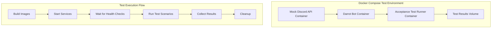

# Darrot Acceptance Test Framework

This directory contains the acceptance test framework for the darrot Discord TTS bot. The framework provides comprehensive end-to-end testing capabilities that validate bot functionality against a mock Discord API server.

## Overview

The acceptance test framework consists of:

- **Test Orchestration Framework**: Core interfaces and execution engine
- **Mock Discord API Server**: Simulates Discord REST API and Gateway
- **Bot Instance Management**: Manages bot lifecycle during testing
- **Audio Processing Validation**: Validates TTS audio generation and streaming
- **Test Scenarios**: Comprehensive test cases covering all bot functionality

## Architecture

### Container-Based Architecture



### File Structure

```
tests/acceptance/
├── docker-compose.test.yml    # Container orchestration
├── Dockerfile.test            # Test runner container
├── container_runner.go        # Container-based test execution
├── run-container-tests.sh     # Test execution script
├── simple_runner.go          # Development test runner
├── framework.go              # Test framework interfaces
├── bot_manager.go            # Bot instance management
├── mock_server.go            # Mock Discord API server
├── audio_validator.go        # Audio processing validation
├── config.go                 # Configuration management
├── scenarios/                # Test scenario implementations
│   ├── core_functionality.go     # Core bot functionality tests
│   ├── concurrent.go             # Multi-user and concurrent tests
│   └── error_resilience.go       # Error handling and resilience tests
└── test-results/             # Test output directory
```

## Test Scenarios

### Core Functionality Tests
- **DarrotJoinCommand**: Tests bot joining voice channels
- **DarrotLeaveCommand**: Tests bot leaving voice channels  
- **TTSMessageProcessing**: Tests text-to-speech message processing
- **ConfigurationCommands**: Tests bot configuration commands

### Concurrent Testing
- **ConcurrentMessageProcessing**: Tests simultaneous user message handling
- **VoiceChannelUserManagement**: Tests voice channel user join/leave events
- **PermissionBasedAccessControl**: Tests role and permission enforcement

### Error Resilience Testing
- **NetworkFailureReconnection**: Tests network failure recovery
- **RateLimitingHandling**: Tests Discord API rate limit handling
- **InvalidCommandHandling**: Tests invalid command error handling
- **MockServerErrorHandling**: Tests HTTP error response handling

## Quick Start

### Current Status

The acceptance test framework has been implemented with two approaches:

#### ✅ Container-Based Testing (Production Ready)
- **Docker Compose orchestration** (`docker-compose.test.yml`)
- **Container test runner** (`container_runner.go`) 
- **Mock Discord API server** (containerized)
- **Real darrot bot testing** (containerized)
- **Automated test execution** (`run-container-tests.sh`)
- **JSON test reporting** with detailed results

#### ✅ Framework Components (Development)
- Test orchestration interfaces (`framework.go`)
- Bot instance management (`bot_manager.go`) 
- Mock Discord API server (`mock_server.go`)
- Audio processing validation (`audio_validator.go`)
- Comprehensive test scenarios (`scenarios/`)

**Recommended Approach**: Use the container-based testing for actual validation of the darrot bot.

**Container Runtime Support**:
- ✅ **Docker** - Traditional container runtime
- ✅ **Podman** - Rootless container runtime (more secure, no daemon required)
- ✅ **Automatic Detection** - Script automatically detects and uses available runtime

### Prerequisites

1. Go 1.21 or later
2. Darrot bot binary built and available (for full testing)
3. Required Go dependencies (see `go.mod`)

### Installation

```bash
cd tests/acceptance
go mod tidy
```

### Basic Usage

#### Container-Based Testing (Recommended)

The framework supports both **Docker** and **Podman** (including rootless Podman).

Run all acceptance tests:
```bash
./run-container-tests.sh run all
```

Run specific test suite:
```bash
./run-container-tests.sh run core
./run-container-tests.sh run concurrent  
./run-container-tests.sh run error
```

Build container images only:
```bash
./run-container-tests.sh build
```

View container logs:
```bash
./run-container-tests.sh logs
```

Clean up containers:
```bash
./run-container-tests.sh cleanup
```

#### Container Runtime Setup

**Docker:**
```bash
# Install Docker Desktop or Docker Engine
# Start Docker daemon
./run-container-tests.sh run all
```

**Podman (Rootless):**
```bash
# Install Podman
sudo apt install podman podman-compose

# Start Podman socket (for rootless)
systemctl --user start podman.socket

# Run tests
./run-container-tests.sh run all
```

#### Simple Test Runner (Development)

For development and testing the framework structure:
```bash
go run simple_runner.go -list
go run simple_runner.go -suite CoreFunctionality
```

### Configuration

Create a configuration file (`config.yaml`):

```yaml
mock_server:
  host: localhost
  port: 8080
  gateway_port: 8081
  startup_timeout: 30s
  response_delay: 100ms

bot:
  binary_path: "./darrot"
  config_path: ""
  startup_timeout: 30s
  log_level: "DEBUG"
  working_dir: "."

audio:
  capture_timeout: 30s
  expected_format: "opus"
  quality_thresholds:
    min_bitrate: 32000
    max_latency: 500ms

test:
  default_timeout: 60s
  retry_attempts: 3
  retry_delay: 1s
  parallel_tests: 1
```

## Test Development

### Creating New Test Scenarios

Implement the `TestScenario` interface:

```go
type MyTestScenario struct {
    // scenario fields
}

func (s *MyTestScenario) Name() string {
    return "MyTestScenario"
}

func (s *MyTestScenario) Description() string {
    return "Description of what this scenario tests"
}

func (s *MyTestScenario) Requirements() []string {
    return []string{"2.1", "2.3"} // Requirement IDs from requirements.md
}

func (s *MyTestScenario) Timeout() time.Duration {
    return 30 * time.Second
}

func (s *MyTestScenario) Setup(ctx context.Context, env *TestEnvironment) error {
    // Setup test environment
    return nil
}

func (s *MyTestScenario) Execute(ctx context.Context, env *TestEnvironment) error {
    // Execute test actions
    return nil
}

func (s *MyTestScenario) Validate(ctx context.Context, env *TestEnvironment) error {
    // Validate test results
    return nil
}

func (s *MyTestScenario) Cleanup(ctx context.Context, env *TestEnvironment) error {
    // Cleanup test resources
    return nil
}
```

### Adding Scenarios to Test Suites

```go
suite := acceptance.NewTestSuite("MyTestSuite", config)
suite.AddScenario(&MyTestScenario{})
```

### Using Test Environment

The `TestEnvironment` provides access to:

```go
// Mock Discord API
env.MockServer.SimulateUser("user-id")
env.MockServer.CreateGuild("guild-id")

// Bot instance management
env.BotInstance.Start(ctx, botConfig)
env.BotInstance.IsHealthy()
env.BotInstance.GetLogs()

// Audio validation
env.AudioCapture.StartCapture("channel-id")
env.AudioCapture.ValidateFormat("channel-id", "opus")

// Logging and data storage
env.LogInfo("Test message")
env.SetTestData("key", value)
env.GetTestData("key")
```

## CI/CD Integration

### GitHub Actions

```yaml
- name: Run Acceptance Tests
  run: |
    cd tests/acceptance
    go run cmd/main.go -config ci-config.yaml -output ${{ github.workspace }}/test-results

- name: Upload Test Results
  uses: actions/upload-artifact@v4
  if: always()
  with:
    name: acceptance-test-results
    path: test-results/
```

### Docker Integration

```bash
# Build bot in container
docker build -t darrot:test .

# Run acceptance tests
docker run --rm -v $(pwd)/tests/results:/results \
  darrot:test /app/tests/acceptance/cmd/main.go -output /results
```

## Test Results

Test results are saved in JSON format with detailed information:

```json
{
  "test_suite": "CoreFunctionality",
  "start_time": "2024-01-15T10:00:00Z",
  "end_time": "2024-01-15T10:05:30Z",
  "duration": "5m30s",
  "total_tests": 4,
  "passed_tests": 4,
  "failed_tests": 0,
  "skipped_tests": 0,
  "test_cases": [
    {
      "name": "DarrotJoinCommand",
      "description": "Tests that the bot correctly responds to darrot-join command",
      "requirements": ["2.3"],
      "status": "passed",
      "duration": "15s",
      "metrics": {
        "execution_time": "15s",
        "memory_usage": 1024000,
        "commands_executed": 1
      }
    }
  ],
  "environment": {
    "os": "linux",
    "architecture": "amd64",
    "go_version": "go1.21.0",
    "bot_version": "dev"
  }
}
```

## Troubleshooting

### Common Issues

1. **Bot fails to start**: Check binary path and permissions
2. **Mock server connection refused**: Verify port availability
3. **Tests timeout**: Increase timeout values in configuration
4. **Audio validation fails**: Check audio format expectations

### Debug Mode

Enable verbose logging:
```bash
go run cmd/main.go -verbose -suite CoreFunctionality
```

Check bot logs in test results directory:
```bash
ls tests/results/test-logs/
```

### Mock Server Issues

Test mock server connectivity:
```bash
curl http://localhost:8080/health
```

Check mock server logs for errors during test execution.

## Performance Considerations

- Tests run sequentially by default to avoid resource conflicts
- Each test scenario includes cleanup to prevent state leakage
- Bot instances are isolated per test for reliability
- Audio capture is limited to prevent memory issues

## Contributing

When adding new test scenarios:

1. Follow the existing naming conventions
2. Include comprehensive error handling
3. Add appropriate logging for debugging
4. Reference specific requirements being tested
5. Include cleanup logic to prevent resource leaks
6. Test scenarios should be idempotent and isolated

## Requirements Traceability

Test scenarios are mapped to requirements from `requirements.md`:

- **Requirement 2.1-2.7**: Core bot functionality validation
- **Requirement 3.1-3.7**: Complex scenarios and edge cases  
- **Requirement 4.1-4.7**: CI/CD integration and reporting
- **Requirement 5.1-5.7**: Audio processing validation

Each test scenario includes a `Requirements()` method that returns the requirement IDs it validates, enabling traceability from requirements to test coverage.